```{r setup, include=FALSE}
usethis::use_git_ignore(c("*.csv", "*.rds"))
options(htmltools.dir.version = FALSE)

library(knitr)
library(tidyverse)
library(xaringan)
library(fontawesome)
```

class: inverse, center, middle

# `r fa("fas fa-images", fill = "#fff")`

**View the slides:** 

[bretsw.com/sdl26-history](https://bretsw.com/sdl26-history/)


---

class: inverse, center, middle

# `r fa("far fa-compass", fill = "#fff")` <br><br> Introduction

---

# `r fa("far fa-compass", fill = "#fff")` Historical Retrospective

```{r, out.width = "600px", echo = FALSE, fig.align = "center"}
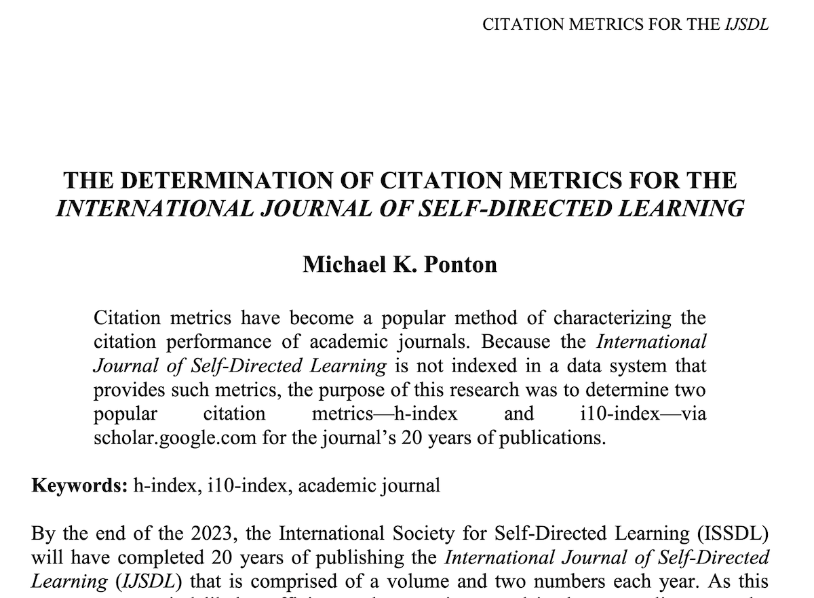
```

Ponton, M. K. (2023). The determination of citation metrics for the International Journal of Self-Directed Learning. *International Journal of Self-Directed Learning, 20*(2), 23–33. https://www.sdlglobal.com/journals

---

# `r fa("far fa-compass", fill = "#fff")` Historical Retrospective

```{r, out.width = "100%", echo = FALSE, fig.align = "center"}
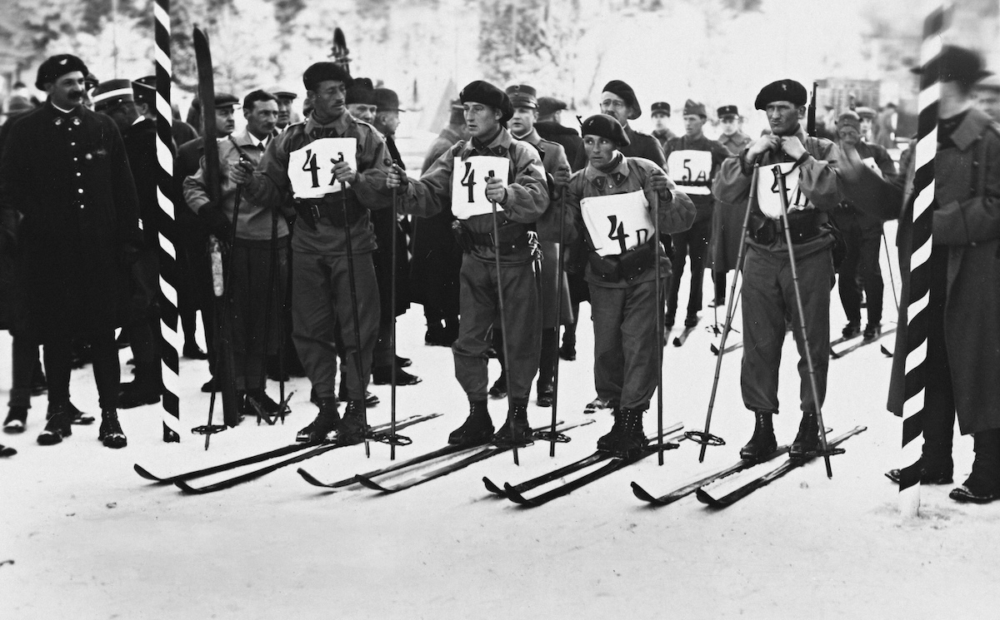
```

### Skiing then...

---

# `r fa("far fa-compass", fill = "#fff")` Historical Retrospective

```{r, out.width = "100%", echo = FALSE, fig.align = "center"}
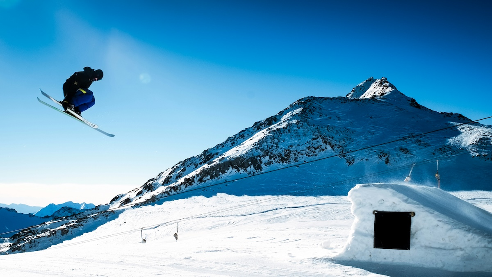
```

### Skiing now...

---

# `r fa("far fa-compass", fill = "#fff")` Historical Retrospective

```{r, out.width = "720px", echo = FALSE, fig.align = "center"}
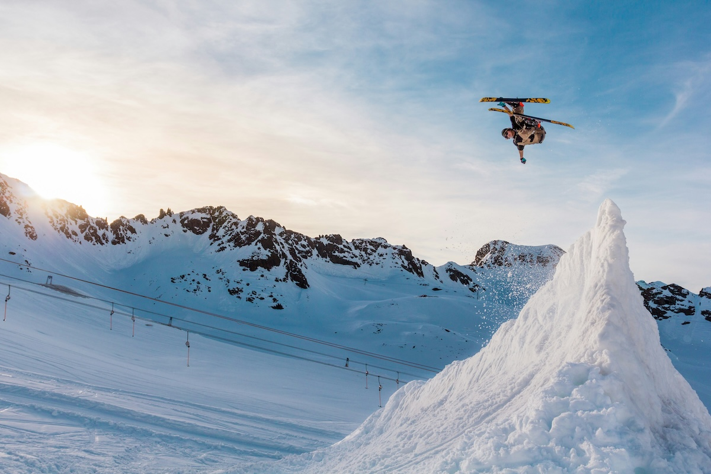
```

### Skiing now...


---

class: inverse, center, middle

# `r fa("far fa-compass", fill = "#fff")` <br><br> Purpose

Explore how SDL has been researched across all disciplines since its origin


---

class: inverse, center, middle

# `r fa("fas fa-list", fill = "#fff")` <br><br> Method 

---

# `r fa("fas fa-list", fill = "#fff")` Method: Data Mining

```{r, out.width = "540px", echo = FALSE, fig.align = "center"}
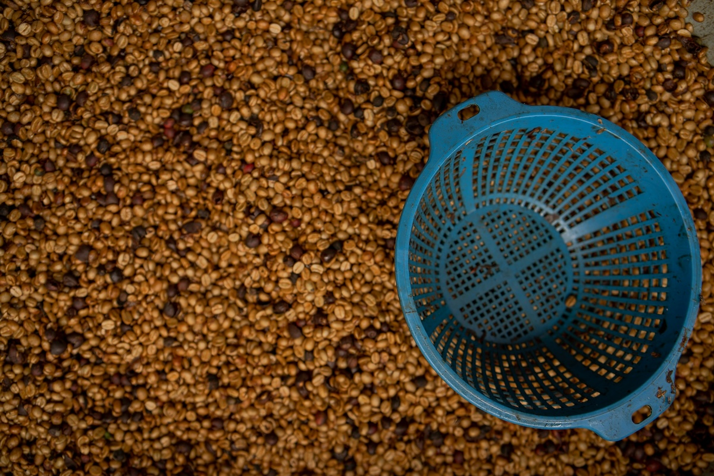
```

--

### Total of 27,876 self-directed learning articles

--

- **Scite.ai:** 22,532 articles (1966-2025)

--

- **Web of Science:** 5,174 articles (1967-2026)

--

- **International Journal of Self-Directed Learning** 170 articles (2004-2023)


---

class: inverse, center, middle

# `r fa("fas fa-cubes-stacked", fill = "#fff")` <br><br> Results

---

class: inverse, center, middle

# `r fa("fas fa-cubes-stacked", fill = "#fff")` <br><br> Results: RQ1 <br>

How has the volume of SDL journal articles changed over time?

---

# `r fa("fas fa-cubes-stacked", fill = "#fff")` Results: RQ1

```{r, out.width = "100%", echo = FALSE, fig.align = "center"}
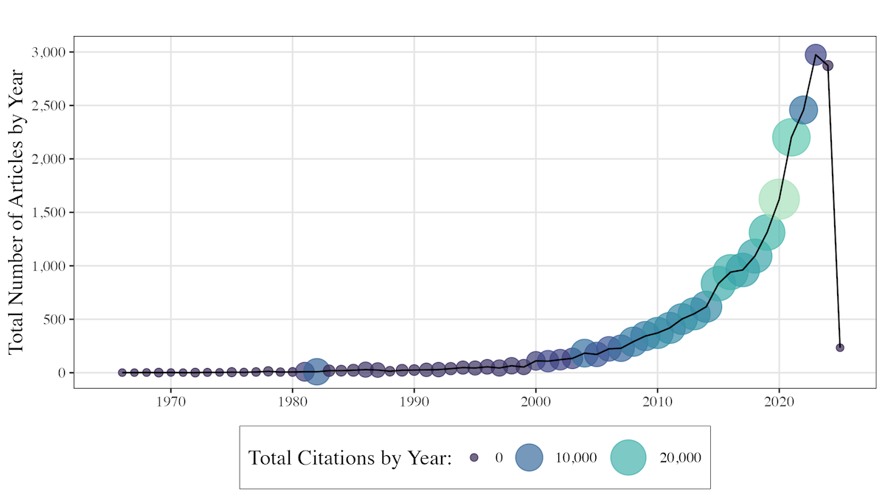
```

**Figure 1.** Total Number of SDL Articles and Citations Per Year, 1966–2025 (Scite.AI)

---

# `r fa("fas fa-cubes-stacked", fill = "#fff")` Results: RQ1

```{r, out.width = "100%", echo = FALSE, fig.align = "center"}
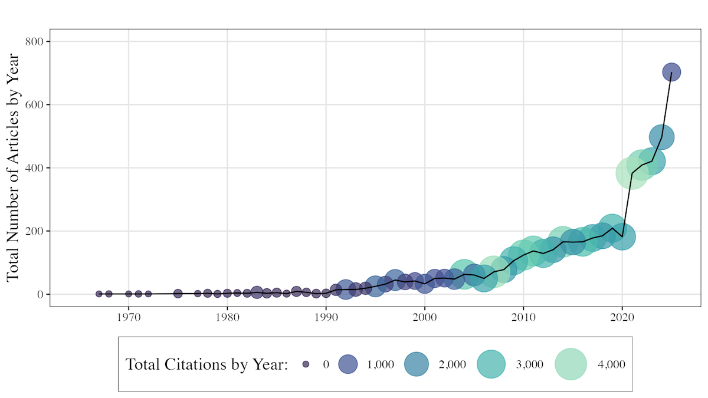
```

**Figure 2.** Total Number of SDL Articles and Citations Per Year, 1967–2026 (Web of Science)

---

# `r fa("fas fa-cubes-stacked", fill = "#fff")` Results: RQ1

```{r, out.width = "100%", echo = FALSE, fig.align = "center"}
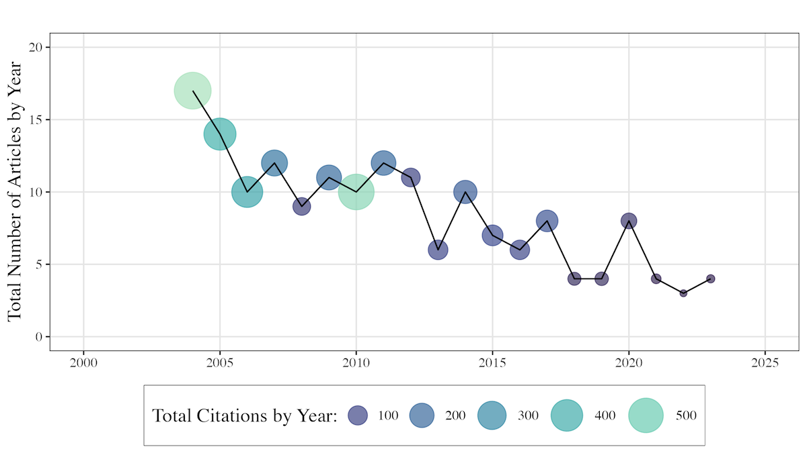
```

**Figure 3.** Total Number of SDL Articles and Citations Per Year, 2004–2023 (IJSDL)


---

class: inverse, center, middle

# `r fa("fas fa-cubes-stacked", fill = "#fff")` <br><br> Results: RQ2 <br> 

How has the impact of SDL journal articles changed over time?

---

# `r fa("fas fa-cubes-stacked", fill = "#fff")` Results: RQ2

```{r, out.width = "100%", echo = FALSE, fig.align = "center"}
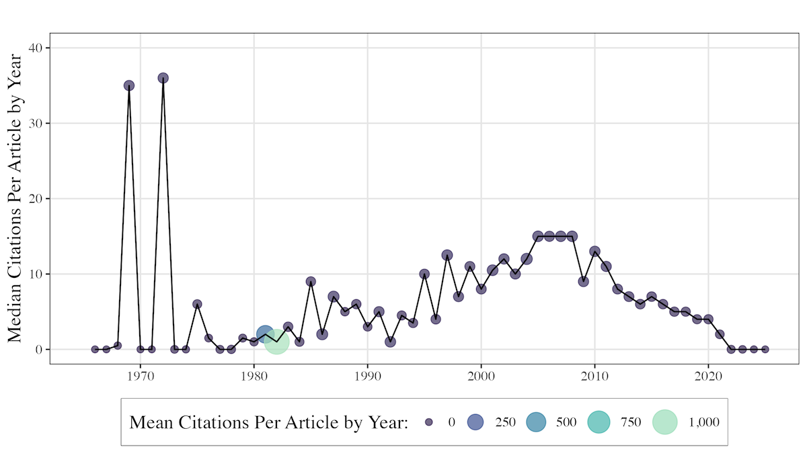
```

**Figure 4.** Mean and Median Citations per SDL Article by Year, 1966–2025 (Scite.ai)

---

# `r fa("fas fa-cubes-stacked", fill = "#fff")` Results: RQ2

```{r, out.width = "100%", echo = FALSE, fig.align = "center"}
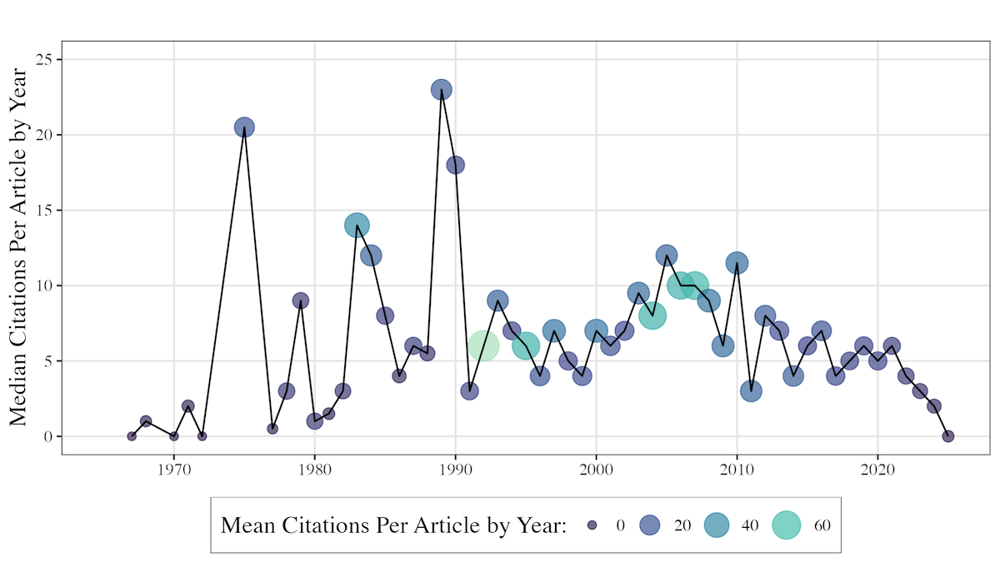
```

**Figure 5.** Mean and Median Citations per SDL Article by Year, 1967–2026 (Web of Science)

---

# `r fa("fas fa-cubes-stacked", fill = "#fff")` Results: RQ2

```{r, out.width = "100%", echo = FALSE, fig.align = "center"}
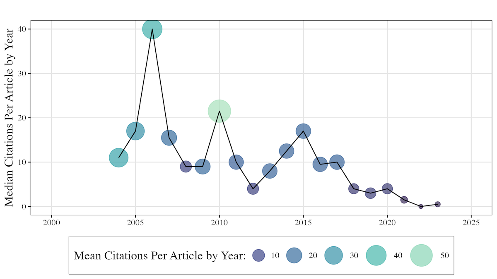
```

**Figure 6.** Mean and Median Citations per SDL Article by Year, 2004–2023 (IJSDL)


---

class: inverse, center, middle

# `r fa("fas fa-cubes-stacked", fill = "#fff")` <br><br> Results: RQ3 <br> 

How has the language used in SDL studies changed over time?

---

# `r fa("fas fa-cubes-stacked", fill = "#fff")` Results: RQ3

```{r, out.width = "360px", echo = FALSE, fig.align = "center"}
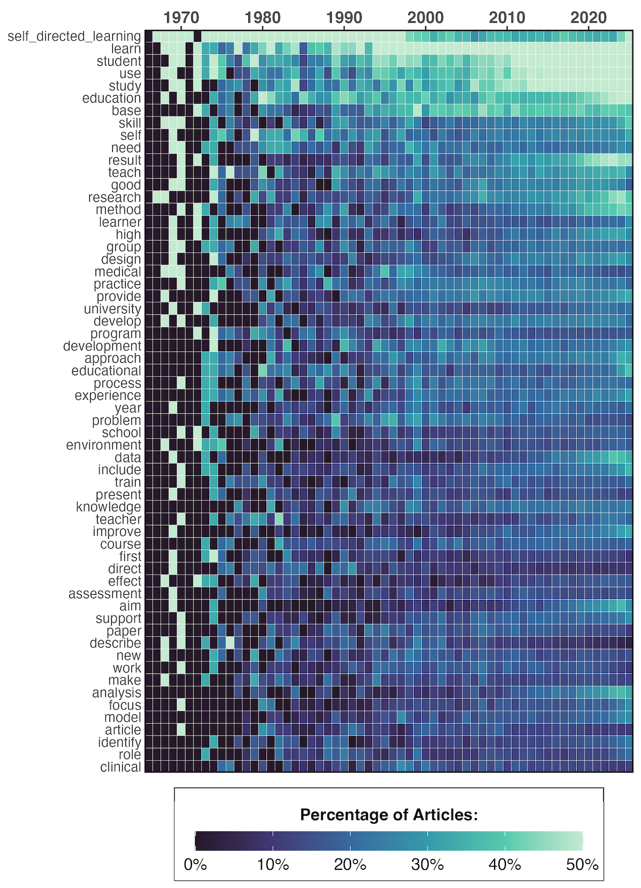
```

**Figure 7.** Top Terms Included SDL Article Titles and Abstracts by Year (Scite.ai)

---

# `r fa("fas fa-cubes-stacked", fill = "#fff")` Results: RQ3

```{r, out.width = "640px", echo = FALSE, fig.align = "center"}
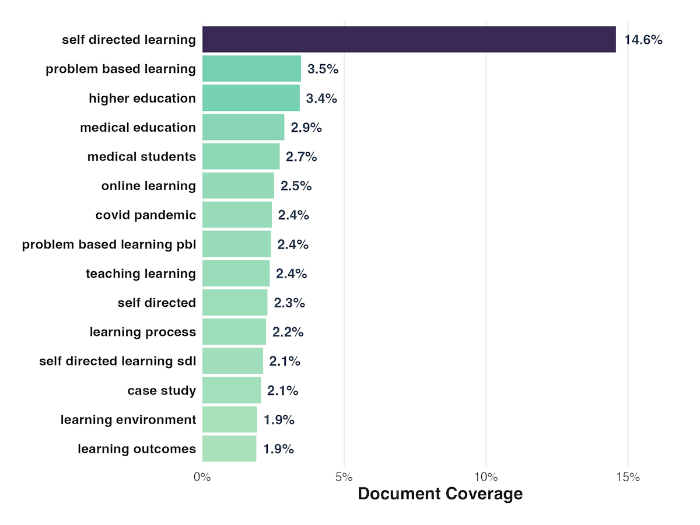
```

**Figure 8.** Key Concepts (Bigrams and Trigrams) in SDL Article Titles (Scite.ai)

---

# `r fa("fas fa-cubes-stacked", fill = "#fff")` Results: RQ3

```{r, out.width = "640px", echo = FALSE, fig.align = "center"}
include_graphics("img/fig9-concept-network-scite.png")
```

**Figure 9.** Concept Network in SDL Article Titles (Scite.ai)


---

class: inverse, center, middle

# `r fa("fas fa-map-pin", fill = "#fff")` <br><br> Implications

---

# `r fa("fas fa-map-pin", fill = "#fff")` Implications

```{r, out.width = "720px", echo = FALSE, fig.align = "center"}
include_graphics("img/implications.jpg")
```

### What does this all mean for the symposium? For the society?


---

class: inverse, center, middle

# `r fa("fas fa-arrows-left-right-to-line", fill = "#fff")` <br><br> Future Research

---

# `r fa("fas fa-arrows-left-right-to-line", fill = "#fff")` Future Research

```{r, out.width = "720px", echo = FALSE, fig.align = "center"}
include_graphics("img/future.jpg")
```

### Where do we go from here?


---

class: inverse, center, middle

# `r fa("fas fa-question", fill = "#fff")` <br><br> Questions

**What would you like to know more about?**

<hr>

<br><br><br><br>

**Bret Staudt Willet | Chufeng Bai** <br><br> Florida State University

`r fa("envelope", fill = "#fff")` [bret.staudtwillet@fsu.edu](mailto:bret.staudtwillet@fsu.edu) | `r fa("globe", fill = "#fff")` [bretsw.com](https://bretsw.com/) | `r fa("fab fa-github", fill = "#fff")` [GitHub](https://github.com/bretsw/)